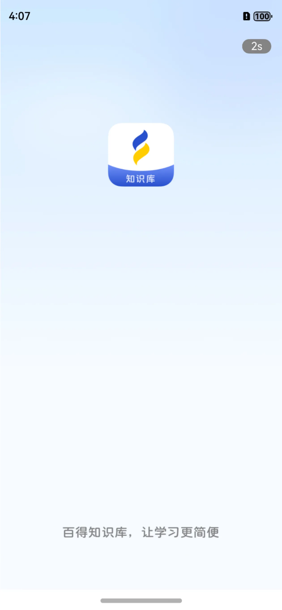
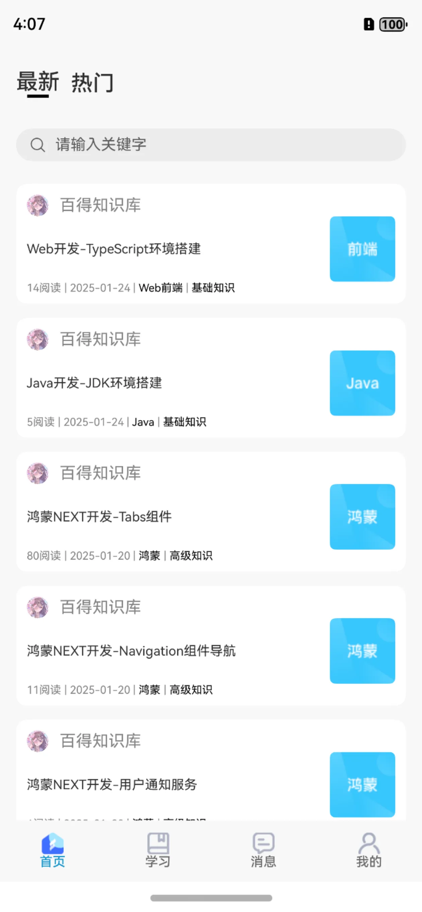
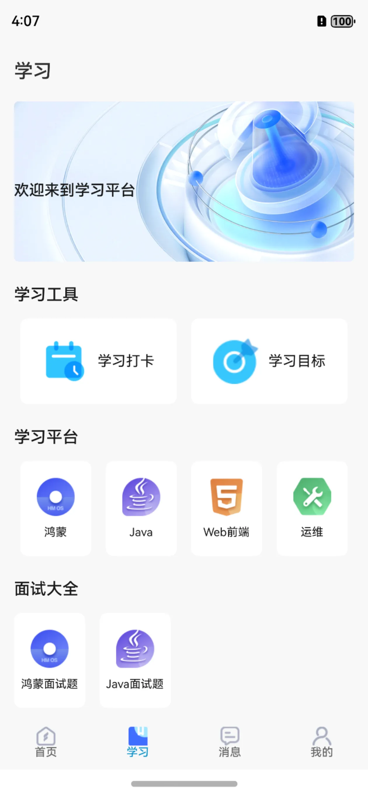
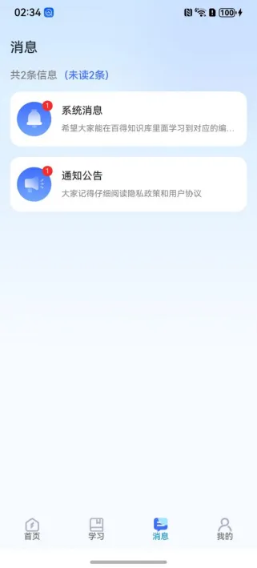
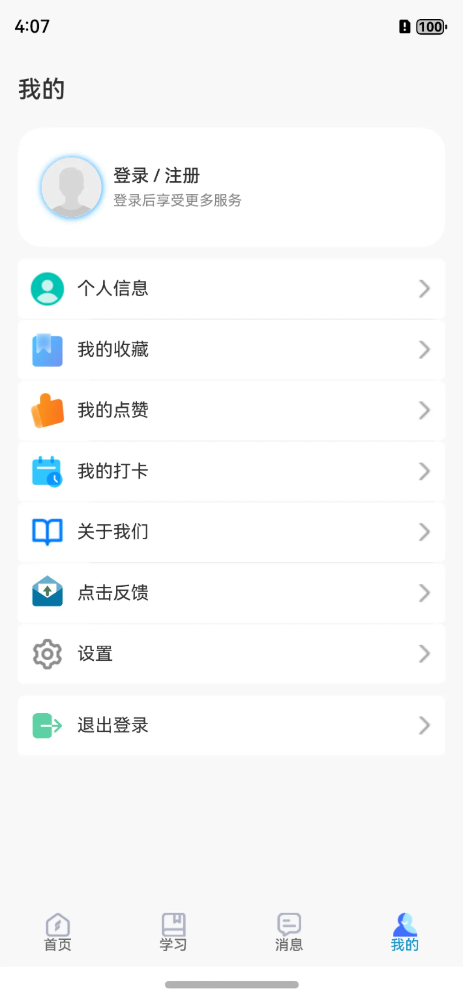

# 系统简介

IbestKnowTeach（百得知识库）是一款基于鸿蒙NEXT开发的APP应用，当前master主分支代码是具备完整功能的，大家没有真机可以使用模拟器运行！  

“百得知识库软件”是一款专注于编程技术领域的学习资源App，旨在为开发者提供丰富的学习材料。  
这里涵盖了广泛的IT相关知识，无论是编程语言、软件开发，还是最新的技术趋势，都能找到详尽的资料。  
该软件不仅有助于开发者提升专业技能，还通过完善的社区和文档支持促进交流与合作。用户可以轻松获取解决方案，参与讨论，从而加速个人成长和技术问题的解决。

# 通过项目学到什么

- 布局
- 三方库的使用和封装
- 组件的封装和使用
- 头像上传
- 应用软件更新
- 日历组件的使用
- 地理位置定位

# 项目大概展示图

## 开屏页



## 首页



## 学习



## 消息



## 我的



# 项目三方库依赖

1、@ohos/axios （网络请求三方库）  
```ohpm install @ohos/axios@2.2.0  ```  
2、@ibestservices/ibest-ui （组件三方库）  
```ohpm install @ibestservices/ibest-ui@2.0.3```

# 需要权限

ohos.permission.INTERNET   
ohos.permission.APPROXIMATELY_LOCATION  

# 注意事项
1、当前项目是基于鸿蒙api 12进行开发的，高版本的api鸿蒙版本也是支持的  
2、服务端是用Java写的，在代码中有对应的请求路径  
3、有部分功能不能在模拟器中使用，比如华为账号登录，我就把他改成普通账号登录了，还有定位打卡模拟器无法使用，还有应用更新等  
4、请勿将该应用进行商业用途  
